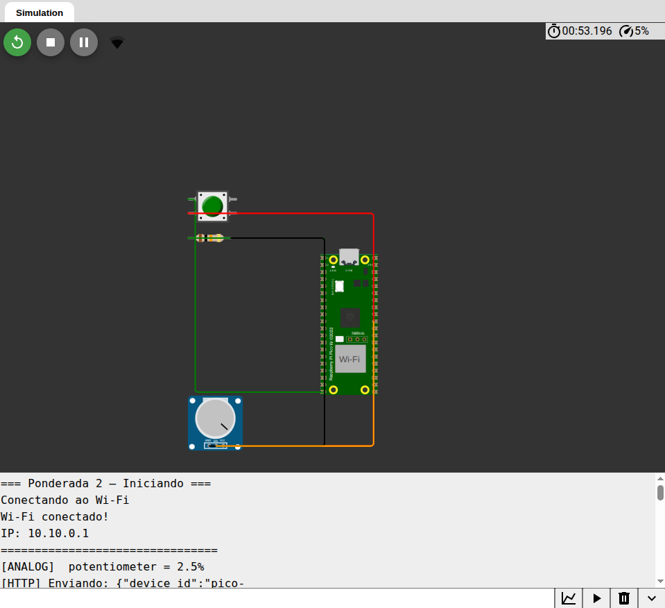
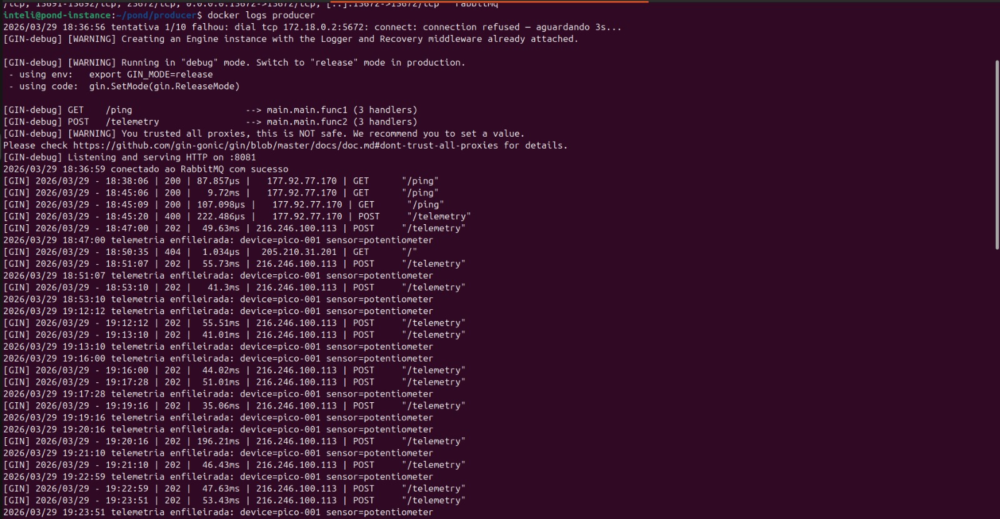
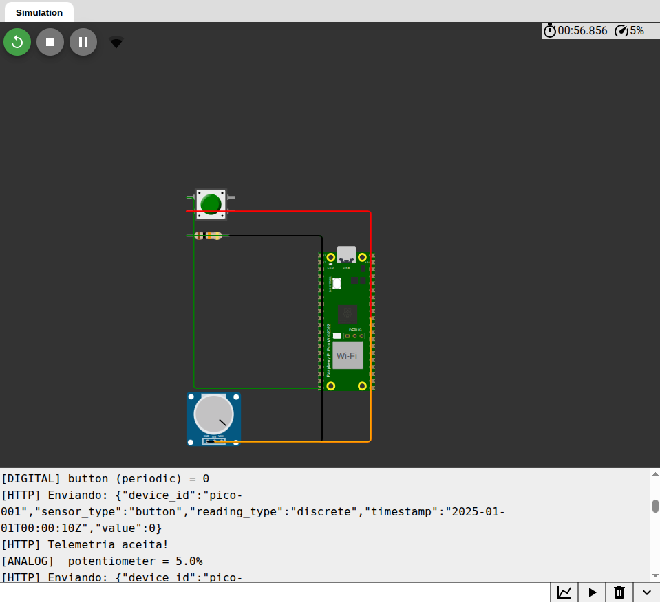

# Ponderada 2 — Integração com Raspberry Pi Pico W

**Continuação da Atividade 1:** [https://github.com/marikamezawa/ponderada2.git](https://github.com/marikamezawa/ponderada2.git)

---

## Descrição

Firmware embarcado para Raspberry Pi Pico W simulado no **Wokwi**, responsável por ler sensores analógicos e digitais via GPIO e enviar telemetrias ao backend desenvolvido na Atividade 1 via HTTP POST.

---

## Framework Utilizado

**Arduino Framework** — via simulador [Wokwi](https://wokwi.com), sem necessidade de Arduino IDE local.

Bibliotecas utilizadas:
- `WiFi.h` — conexão Wi-Fi
- `HTTPClient.h` — envio de requisições HTTP POST

---

## Sensores Integrados

| Sensor | Tipo | Pino GPIO | Range de Valores | `reading_type` |
|---|---|---|---|---|
| Potenciômetro | Analógico | GP26 (ADC0) | 0 – 4095 (bruto) / 0–100% | `analog` |
| Botão | Digital | GP15 | 0 (solto) ou 1 (pressionado) | `discrete` |

### Detalhes

**Potenciômetro (analógico):**
- Lido via ADC no pino GP26
- Aplicada média móvel com janela de 10 amostras para suavização
- Valor percentual calculado para exibição no Serial Monitor (`0–100%`)
- Valor bruto (0–4095) enviado ao backend
- Envio periódico a cada 3 segundos

**Botão (digital):**
- Lido via GPIO no pino GP15 com `INPUT_PULLDOWN`
- Debouncing implementado por software (delay de 50ms)
- Envia imediatamente ao detectar mudança de estado (HIGH/LOW)
- Envia também periodicamente a cada 3 segundos junto com o analógico

---

## Diagrama de Conexão

```
Raspberry Pi Pico W (simulado no Wokwi)
┌─────────────────────────────────┐
│                                 │
│  GP15 ──────── Botão ──── GND  │
│                                 │
│  GP26 (ADC0) ── Potenciômetro  │
│  3V3  ──────── VCC (pot)       │
│  GND  ──────── GND (pot)       │
│                                 │
└─────────────────────────────────┘
```

O diagrama completo pode ser encontrado no arquivo [diagram.json](/Wokwi/diagram.json) do projeto Wokwi.

---

## Configuração de Rede

No arquivo [sketch.ino](/Wokwi/sketch.ino), ajuste as seguintes constantes conforme seu ambiente:

```cpp
// Rede Wi-Fi (no Wokwi use "Wokwi-GUEST" com senha vazia)
const char* WIFI_SSID     = "Wokwi-GUEST";
const char* WIFI_PASSWORD = "";

// Endpoint do backend (Atividade 1)
const char* BACKEND_URL = "http://<SEU_IP>:8081/telemetry";

// Identificação do dispositivo
const char* DEVICE_ID = "pico-001";
```

---

## Como Executar no Wokwi

1. Acesse [https://wokwi.com](https://wokwi.com) e crie um novo projeto para **Raspberry Pi Pico W**
2. Substitua o conteúdo do `sketch.ino` pelo código deste repositório
3. Importe o `diagram.json` para montar o circuito (botão no GP15 e potenciômetro no GP26)
4. Ajuste `BACKEND_URL` com o IP do seu backend
5. Clique em **▶ Start Simulation**
6. Acompanhe os logs no **Serial Monitor**

---

## Formato do Payload Enviado

As telemetrias são enviadas via HTTP POST para o endpoint `/telemetry` no formato JSON:

```json
{
  "device_id": "pico-001",
  "sensor_type": "potentiometer",
  "reading_type": "analog",
  "timestamp": "2025-01-01T00:00:05Z",
  "value": 101
}
```

```json
{
  "device_id": "pico-001",
  "sensor_type": "button",
  "reading_type": "discrete",
  "timestamp": "2025-01-01T00:00:05Z",
  "value": 1
}
```

O campo `value` é compatível com o tipo `JSONB` esperado pelo backend da Atividade 1.

---

## Mecanismo de Retry

Em caso de falha no envio (código HTTP diferente de `202`), o firmware aguarda 1 segundo e realiza uma nova tentativa usando um objeto `HTTPClient` separado. Caso o retry também falhe, o erro é logado no Serial Monitor e o loop continua normalmente.

---

## Evidências de Funcionamento

### Conexão Wi-Fi 
<p align="center">
  
</p>

###  Envios bem-sucedidos 

<p align="center">
  
</p>

### Requisições HTTP chegando no backend

<p align="center">
  
</p>

### Dados Recebidos na tabela

<p align="center">
  
</p>

